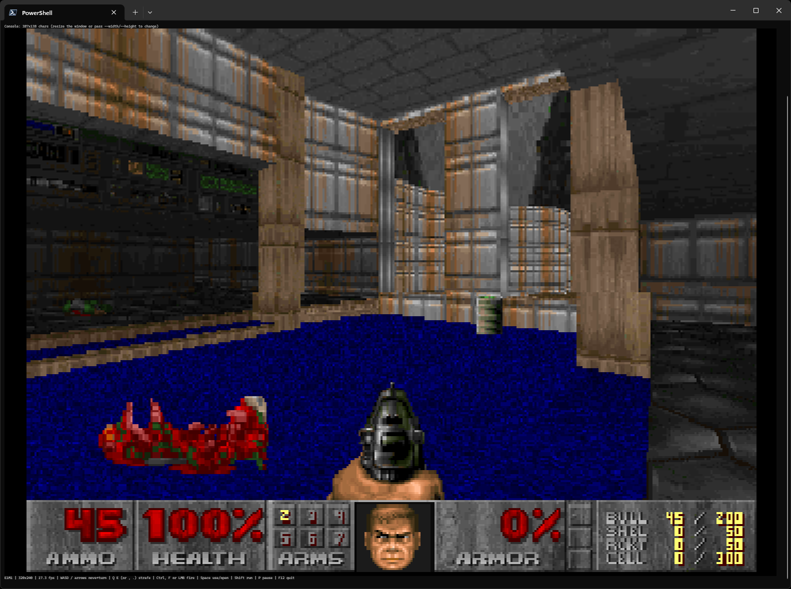

# DOOM CLI

Real DOOM — the actual shareware `DOOM1.WAD` — playable, with your **text
terminal as the monitor**.

A fork of [MS Paint Doom](https://github.com/markrussinovich/DoomPaint) that swaps the display and input
layers for the console, in the spirit of the reference super-mario-cli:



**Author**: Alexander Gmar. This variant is based on Mark Russinovich's MS Paint Doom.

- **Display** — every frame is downsampled to the terminal's character grid
  and drawn as 24-bit-color half-blocks (▀), aspect-preserving (centered,
  letterboxed black) — the console technique from super-mario-cli.
- **Input** — on Windows, plain `GetAsyncKeyState` polling; on Linux/macOS
  the terminal itself is read (raw mode + the Kitty keyboard protocol), so it
  works over SSH, in WSL, inside tmux/screen, with no extra permissions.

Everything else is the same real engine: ViZDoom runs the shareware
`DOOM1.WAD` (with the BSD-licensed Freedoom WADs covering the episodes
shareware doesn't ship), sound effects come from the engine, and the map's
soundtrack is pulled from the WAD and looped — via Windows' built-in MIDI
sequencer on Windows, and via fluidsynth on Linux/macOS.

## Run

Windows:

```
run.bat
```

Linux / macOS:

```
./run.sh
```

(Each creates a venv and installs dependencies on first run; `run.sh` needs
`python3-venv`.) Linux/macOS system deps on Ubuntu:

```
sudo apt install python3-venv libsdl2-2.0-0 libopenal1 fluidsynth fluid-soundfont-gm
```

Resize your terminal to taste — the game adapts to the
character grid on every frame — and play:

| Key | Action |
|-----|--------|
| `W` `S` / ↑ ↓ | move forward / back |
| `A` `D` / ← → | turn |
| `Q` `E` (or `,` `.`) | strafe |
| Ctrl or `F` | fire |
| Space | use / open doors |
| Shift | run |
| `P` | pause |
| F12 | quit |

`Ctrl` is captured as the fire key, and `Ctrl+C` / `Ctrl+Break` are ignored so
a stray chord can never kill the game.

### Options

- `--map E1M1` — map to load (`E1M1`.. for wad 1, `MAP01`.. for wad 2)
- `--wad 1|2` — Freedoom Phase 1 (default) / Phase 2
- `--res 320x200|320x240|640x400|640x480` — engine render resolution
  (default `320x240`; the console output is downsampled from it, so the small
  sizes are plenty and cheap)
- `--skill 1..5` — difficulty (default 3)
- `--no-sound` — all audio off
- `--no-music` — keep sound effects, skip the soundtrack
- `--music-volume 0..100` — music loudness (default 40)
- `--music-wad PATH` — WAD to take the soundtrack from
- `--width COLS` — fixed console width (default: the terminal's current width)
- `--height ROWS` — fixed console height (default: the terminal's current height)
- `--pause-on-focus-loss` — pause when the terminal isn't the foreground
  window (off by default; the conhost-handle check is unreliable inside hosts
  like Windows Terminal)

### Linux & macOS notes

- **Requirements** are split by platform automatically (`pywin32`/`pycaw` on
  Windows only). `run.sh` installs the right set.
- **Input** reads the terminal itself in raw mode — no X server, no extra
  permissions. It works in WSL, over SSH, inside tmux/screen, anywhere a real
  terminal is attached. **Windows Terminal is the recommended terminal** —
  it renders the game fast and smoothly. The game asks the terminal for the
  **Kitty keyboard protocol** (`CSI > 31 u`), which modern terminals (Windows
  Terminal, kitty, iTerm2 3.4+, foot, WezTerm, Konsole…) honor — those get
  exact press/release events (no release lag), and terminals that also report
  bare modifier keys get *bare Ctrl = fire* (confirmed working on Windows:
  **Alacritty**, though it renders this game slower). Windows Terminal
  suppresses bare modifier keys by design (see microsoft/terminal#20499), so
  there you fire with **F**, **Ctrl+WASD** / **Ctrl+arrows**, or the **left
  mouse button**. Terminals that don't support the protocol at all keep
  working in a degraded mode:
  - held keys are tracked via key auto-repeat with a ~0.1 s release lag;
  - Shift-as-run is detected when held with a letter key (uppercase implies
    Shift) or with the arrow keys (the terminal encodes the Shift modifier in
    the escape sequence); a bare Shift press is invisible to such a terminal,
    so Shift alone won't run;
  - Ctrl+letter / Ctrl+arrow still move while firing (F fires either way);
  - **fire** works everywhere via `F`, `Ctrl+WASD` / `Ctrl+arrows`, or holding
    the **left mouse button** (SGR mouse tracking) — useful because Windows
    Terminal never reports bare modifier keys (Ctrl/Shift/Alt alone) at all,
    so *bare Ctrl = fire* is impossible there;
  - F12 quits.
- **Music**: the WAD's own MIDI soundtrack is looped on every platform. On
  Windows via the built-in MIDI sequencer (MCI); on Linux/macOS it's rendered
  to WAV by **fluidsynth** and played through pygame (cached per track).
  Ubuntu: `sudo apt install fluidsynth fluid-soundfont-gm`;
  macOS: `brew install fluidsynth fluid-soundfont`.
- **macOS**: everything here is POSIX code and works as on Linux. Bare Ctrl =
  fire needs a terminal that speaks the Kitty protocol — Apple's Terminal.app
  doesn't; use iTerm2 3.4+ or Alacritty for it. Sound effects come from the
  engine's OpenAL; on macOS this has historically been finicky in ViZDoom, so
  if SFX are silent the game still runs (music plays regardless).
- **Engine window**: on POSIX the engine renders headlessly via SDL's dummy
  video driver (`SDL_VIDEODRIVER=dummy`), so no window ever appears.
- **Troubleshooting** — if the engine fails to initialize, install its system
  libraries, e.g. on Ubuntu:
  `sudo apt install python3-venv libsdl2-2.0-0 libopenal1` (sound effects
  also need `libopenal1`; if they're silent, see the ViZDoom FAQ about
  OpenAL 1.19 / `+snd_efx 0`, which this game applies automatically on
  POSIX).

**Game data & soundtrack**: `wad\doom1.wad` — the freely-distributable
shareware episode — is both the game data and the source of the real Bobby
Prince tracks for episode 1. Maps shareware doesn't ship (`--map E2M1`+,
`--wad 2`) fall back to Freedoom for both game data and music. If you own the
full game, drop its `doom.wad` (or `doom2.wad`) into `wad\` for the rest of
the soundtrack, or pass `--music-wad PATH`.

If sound effects are silent on Linux: install `libopenal1` (and see the
ViZDoom FAQ about OpenAL 1.19 — `+snd_efx 0` is applied automatically on
POSIX). On Windows, check the boot log's `Audio out: <device> at <N>%` line.
Music needs `fluidsynth` + `fluid-soundfont-gm` on Linux/macOS (Windows plays
it through the built-in MIDI sequencer). The game repairs its own per-app
mixer volumes at startup and rebuilds the engine's sound system once at boot
(its audio init can come up silently broken).

While playing, the bottom status row shows the map, resolution, a live `fps`
ticker, and the control summary (truncated to the terminal width).

Debugging: every session writes `last_run.log` (boot args, pauses, input-free
frame stats, engine audio self-heal events).

## How it works

1. **Engine** — ViZDoom steps the simulation on a dedicated thread at Doom's
   native 35 Hz tic rate, rendering headlessly (`set_window_visible(False)`,
   window parked off-screen so nothing flashes).
2. **Display** — the render thread picks up the freshest finished frame, maps
   it onto the terminal's character grid (each cell = two pixel rows via the
   upper-half-block `▀`; nearest-neighbor so the picture stays crisp), and
   writes one ANSI frame. The frame is centered and letterboxed to preserve
   the source's pixel aspect — with a normal half-width terminal font one
   source pixel draws as one square on screen.
3. **Pacing** — no tuned frame rate. A new frame is drawn only when the engine
   has advanced a tic (35 Hz cap) and the terminal has accepted the previous
   one, so the effective rate is `min(35 Hz, this terminal's draw rate)` and
   scales to the hardware automatically.
4. **Input** — sampled once per tic on the engine thread via
   `GetAsyncKeyState`; the OS's "pressed since last call" latch still catches a
   key tapped and released between samples, so a quick fire tap registers.
5. **Sound** — engine effects through ViZDoom/OpenAL (pinned volume, proactive
   `snd_reset`, and a firing-into-silence self-heal, all inherited from the
   Paint build). Music is the map's lump from the game WAD (MUS→MIDI when
   needed): on Windows it loops through the built-in MIDI sequencer (MCI); on
   Linux/macOS the MIDI is rendered once to WAV by fluidsynth and looped
   through pygame.mixer.music — cached per track, so only the first play of a
   map needs the synthesizer.

## Files

- `doomcli/` — the app: `main.py` (loop), `console_out.py` (terminal
  framebuffer: grid fit + ANSI encoding, POSIX raw-input mode), `keys.py`
  (input: GetAsyncKeyState polling on Windows, terminal reading on POSIX),
  `engine_vzd.py` (ViZDoom wrapper), `music.py` (WAD music → MIDI → MCI on
  Windows / fluidsynth+pygame on POSIX)
- `wad\doom1.wad` — shareware DOOM (game data + episode 1 soundtrack)
- `third_party\OpenAL32.dll` + `third_party\OpenAL-COPYING.txt` — OpenAL-Soft
  1.24 (installed over ViZDoom's by `run.bat`, Windows only) and its LGPL
  license
- `run.bat` / `run.sh` — launchers (Windows / Linux, macOS)
- `img\DoomCLI_screenshot.png` — screenshot used in this README
- `last_run.log` — written every session
- `smoke_test.py` — engine boots headless + encodes a frame, no terminal
  needed

## Honest asterisks

- The engine is ViZDoom (ZDoom-based). Game data for episode 1 is the real
  **shareware `DOOM1.WAD`** (freely distributable, in `wad\`); maps beyond
  episode 1 fall back to Freedoom.
- ViZDoom boots straight into the map — no title screen, no attract demos,
  no in-game menus.
- The terminal renders the game but does not compute it. The terminal
  computes nothing. That's the joke.

## License

The project is **MIT** (see [`LICENSE`](./LICENSE)), copyright (c) 2026
Mark Russinovich (original MS Paint Doom) and Alexander Gmar (DOOM CLI console
variant).

Third-party bits keep their own terms:

- **OpenAL-Soft** (`third_party\OpenAL32.dll`) — LGPL v2, license in
  [`third_party\OpenAL-COPYING.txt`](third_party/OpenAL-COPYING.txt)
- **DOOM shareware WAD** (`wad\doom1.wad`) — id Software's shareware terms
  (freely redistributable as-is, not open source)
- **Freedoom** — BSD, bundled with the `vizdoom` package
- **fluidsynth / fluid-soundfont-gm** (Linux/macOS music) — their own licenses,
  installed via your distro's package manager
